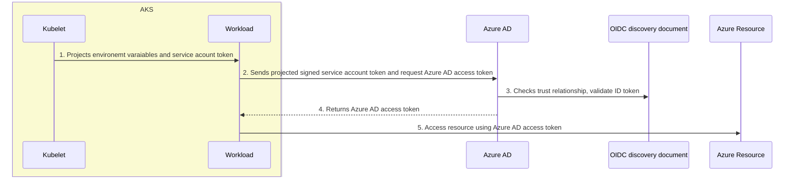
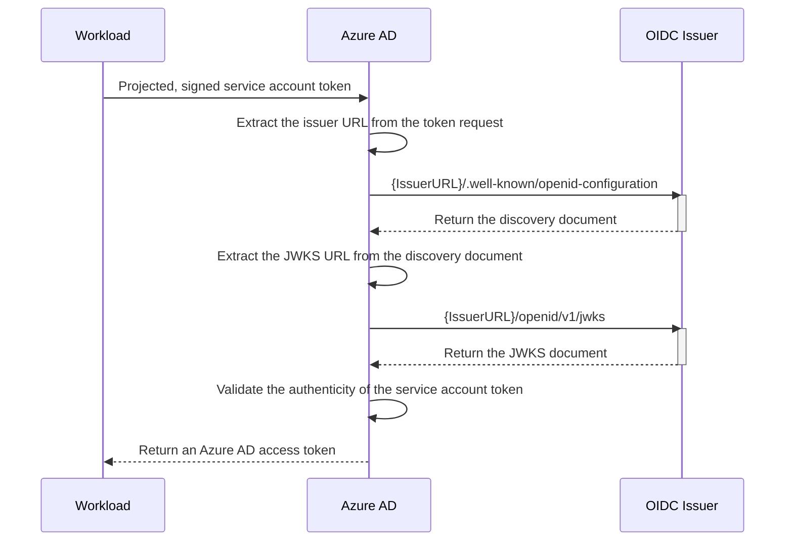
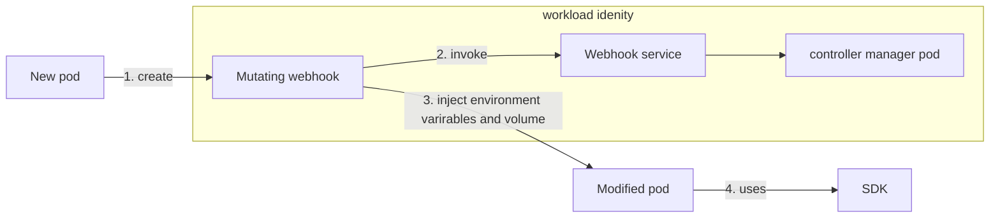

# Azure Workload Identity

## 1. Introduction

[Azure AD workload identity](https://azure.github.io/azure-workload-identity/docs/introduction.html) uses [Service Account Token Volume Projection](https://kubernetes.io/docs/tasks/configure-pod-container/configure-service-account/#serviceaccount-token-volume-projection) enabling pods to use a Kubernetes identity (that is, a service account). A Kubernetes token is issued and [OIDC federation](https://kubernetes.io/docs/reference/access-authn-authz/authentication/#openid-connect-tokens) enables Kubernetes applications to access Azure resources securely with Azure AD based on annotated service accounts.

## 2. Workload Identity Federation​

Typically, an applicaiton service running outside of Azure uses a secret or certificate to access protected resources in Azure, Microsoft Graph or Microsoft 365.

Secrets and certificates pose a secruity risk and can also expire which leads to service downtime. Managing secretes properly is hard and takes developers away from their real work building products. 

Workload Identity Federation allows you to access Azure Active Directory. Azure AD protected resources without needing to manage secrets. 

You use workload identity federation to configure an user-assigned managed identity or app registration in Azure AD to trust tokens from an external identity provider (IdP), such as GitHub or Google so your external software can access the resources to which the applicaiton registration has been granted access. 

## 3. General workflow


- *External workload* such as an application, service, script, or container-based application

- *External identity provider* such as kube-api-server or other identity provider

### 3.1 How it works in AKS

In this model, the Kubernetes cluster becomes a token issuer, issuing tokens to Kubernetes Service Accounts. These service account tokens can be configured to be trusted on Azure AD applications or user-assigned managed identities. Workload can exchange a service account token projected to its volume for an Azure AD access token using the Azure Identity SDKs or the Microsoft Authentication Library (MSAL).


### 3.2 How to valid incoming token



<details>
  <summary>Example of {IssuerURL}/.well-known/openid-configuration</summary>

```json
{
    "issuer": "https://eastus.oic.prod-aks.azure.com/72f988bf-86f1-41af-91ab-2d7cd011db47/257f8561-5fce-4b05-a41c-edb625656b07/",
    "jwks_uri": "https://eastus.oic.prod-aks.azure.com/72f988bf-86f1-41af-91ab-2d7cd011db47/257f8561-5fce-4b05-a41c-edb625656b07/openid/v1/jwks",
    "response_types_supported": [
        "id_token"
    ],
    "subject_types_supported": [
        "public"
    ],
    "id_token_signing_alg_values_supported": [
        "RS256"
    ]
}
```
</details>

### 3.3 How injection works



Webhook injects required *[environment variables](https://github.com/Azure/azure-workload-identity/blob/main/pkg/webhook/webhook.go#L354)* and *[projected service account token](https://github.com/Azure/azure-workload-identity/blob/main/pkg/webhook/webhook.go#L396)* volume into pod spec (click links for source code).

<details>
  <summary>Example of injected pod yaml</summary>

```yaml
spec:
  containers:
    env:
    - name: AZURE_CLIENT_ID
      value: d26641b9-xxxx-yyyy-zzzz-cb3a513b2502
    - name: AZURE_TENANT_ID
      value: 72f988bf-xxxx-yyyy-zzzz-2d7cd011db47
    - name: AZURE_FEDERATED_TOKEN_FILE
      value: /var/run/secrets/azure/tokens/azure-identity-token
    - name: AZURE_AUTHORITY_HOST
      value: https://login.microsoftonline.com/
    image: mcr.microsoft.com/azure-cli
    imagePullPolicy: Always
    name: oidc
    volumeMounts:
    - mountPath: /var/run/secrets/azure/tokens
      name: azure-identity-token
      readOnly: true
  volumes:
  - name: azure-identity-token
    projected:
      defaultMode: 420
      sources:
      - serviceAccountToken:
          audience: api://AzureADTokenExchange
          expirationSeconds: 3600
          path: azure-identity-token
```
</details>

### 3.4 How azure-identity-token is generated

Using [Service Account Token Volume Projection](https://kubernetes.io/docs/tasks/configure-pod-container/configure-service-account/#serviceaccount-token-volume-projection) to create token.

```bash
# kube-apiserver
  --service-account-signing-key-file=/etc/kubernetes/secrets/sa-key.pem
  --service-account-key-file=/etc/kubernetes/secrets/sa-key.pem
  --service-account-issuer=https://eastus.oic.prod-aks.azure.com/72f988bf-86f1-41af-91ab-2d7cd011db47/257f8561-5fce-4b05-a41c-edb625656b07/
```
**audiences** — The audience that can appear in the external token. This field is mandatory and should be set to api://AzureADTokenExchange for Azure AD. 

**issuer** — The URL of the external identity provider. Must match the issuer claim of the external token being exchanged.

**subject** — The identifier of the external software workload within the external identity provider. In AKS the unique format is:

```bash
system:serviceaccount:$SERVICE_ACCOUNT_NAMESPACE:$SERVICE_ACCOUNT_NAME
```

The combination of issuer and subject must be unique on the app.

### 3.5 Service Account

> A service account provides an identity for processes that run in a Pod.

Azure AD Workload Identity supports the following mappings:

**One-to-One**

A service account referencing an AAD object

DefaultAzureCredential will use the environment variables injected by the Azure Workload Identity mutating webhook to authenticate with Azure Resource.

Defaults to the value of the environment variable AZURE_CLIENT_ID.

<details>
  <summary>Example in Go</summary>

```golang
	cred, err := azidentity.NewDefaultAzureCredential(nil)
	if err != nil {
		  log.Fatal(err)
	}
```
</details>
<br/>

**Many-to-One**

Multiple service accounts referencing the same AAD object.

It is possible to have a many-to-one relationship between multiple identities and a Kubernetes service account, i.e. you can create multiple federated identity credentials that reference the same service account in your Kubernetes cluster.

<details>
  <summary>Example yaml</summary>

```json
apiVersion: v1
kind: ServiceAccount
metadata:
  annotations:
    azure.workload.identity/client-id: "${USER_ASSIGNED_CLIENT_ID}"
  name: "${SERVICE_ACCOUNT_NAME_1}"
  namespace: "${SERVICE_ACCOUNT_NAMESPACE_1}"

apiVersion: v1
kind: ServiceAccount
metadata:
  annotations:
    azure.workload.identity/client-id: "${USER_ASSIGNED_CLIENT_ID}"
  name: "${SERVICE_ACCOUNT_NAME_2}"
  namespace: "${SERVICE_ACCOUNT_NAMESPACE_2}"
```
</details>
<br/>

**One-to-Many**

A service account referencing multiple AAD objects by changing the client ID annotation.

> Note: if the service account annotations are updated, you need to restart the pod for the changes to take effect.

<details>
  <summary>Example yaml</summary>

```json
apiVersion: v1
kind: ServiceAccount
metadata:
  annotations:
    azure.workload.identity/client-id: "${USER_ASSIGNED_CLIENT_ID}"
  name: "${SERVICE_ACCOUNT_NAME}"
  namespace: "${SERVICE_ACCOUNT_NAMESPACE}"
```
</details>
<br/>

[*Reference: Service Account*](https://azure.github.io/azure-workload-identity/docs/topics/service-account-labels-and-annotations.html#service-account)

OR you can specify MI client ID via SDK when creating credential.

<details>
  <summary>Example in Go</summary>

```golang
	wiClientID := os.Getenv("WI_CLIENT_ID")
	subID := os.Getenv("SUB_ID")

	cred, err := azidentity.NewWorkloadIdentityCredential(&azidentity.WorkloadIdentityCredentialOptions{ClientID: wiClientID})
	if err != nil {
		log.Fatal(err)
	}
```
</details>
<br/>

## 4. Testing

### 4.1 Quick testing

Using azure cli to quickly get access token via workload identity

<details>
  <summary>Example</summary>

```bash
cat <<EOF | kubectl apply -f -
apiVersion: v1
kind: Pod
metadata:
  name: quick-cli
  namespace: ${SERVICE_ACCOUNT_NAMESPACE}
  labels:
    azure.workload.identity/use: "true"
spec:
  serviceAccountName: ${SERVICE_ACCOUNT_NAME}
  containers:
    - image: mcr.microsoft.com/azure-cli
      name: oidc
      imagePullPolicy: Always
      command: ["/bin/bash"]
      args: ["-c", "sleep 999999"]
  nodeSelector:
    kubernetes.io/os: linux
EOF
```

```bash
kubectl exec -it quick-cli -- bash

az login --federated-token "$(cat $AZURE_FEDERATED_TOKEN_FILE)" --service-principal -u $AZURE_CLIENT_ID -t $AZURE_TENANT_ID --allow-no-subscriptions

az account get-access-token --resource https://graph.microsoft.com
```

</details>
<br/>

### 4.2 More SDK examples

https://github.com/Azure-Samples/azure-sdk-for-go-samples

https://github.com/Azure/azure-workload-identity/tree/main/examples

### 4.3 Terraform 

TODO

https://github.com/tdihp/myakshack/tree/main/walkthroughs/workload-identity

## 5. Troubleshooting

#### Is workload identity pod running?

```bash
➜  ~ kubectl -n kube-system get pods -l azure-workload-identity.io/system="true"
NAME                                                   READY   STATUS    RESTARTS   AGE
azure-wi-webhook-controller-manager-7b4fb69774-5zbtn   1/1     Running   0          2d21h
azure-wi-webhook-controller-manager-7b4fb69774-qmcdq   1/1     Running   0          2d21h
```
#### Does the pod using workload identity has required label? 

make sure azure.workload.identity/use: "true" is present in pod

#### Does the pod using workload identity has correct environment injected? 

```bash
quick-cli:/# printenv | grep AZURE
AZURE_TENANT_ID=72f988bf-86f1-41af-91ab-2d7cd011db47
AZURE_FEDERATED_TOKEN_FILE=/var/run/secrets/azure/tokens/azure-identity-token
AZURE_AUTHORITY_HOST=https://login.microsoftonline.com/
AZURE_CLIENT_ID=d26641b9-074b-4e46-8c1f-cb3a513b2502
```

#### Does the pod has project volume?

```yaml
  - name: azure-identity-token
    projected:
      defaultMode: 420
      sources:
      - serviceAccountToken:
          audience: api://AzureADTokenExchange
          expirationSeconds: 3600
          path: azure-identity-token
```

### Get mutating admission webhook pod logs

```bash
kubectl -n kube-system logs -l azure-workload-identity.io/system=true --since=1h 
```

#### Decode token file with JWT

Check toke file via https://jwt.ms/

## Common errors

**AADSTS70021**

```json
{"error":"invalid_request","error_description":"AADSTS70021: No matching federated identity record found for presented assertion. Assertion Issuer: 'https://AKS oidc url>'. Assertion Subject: 'system:serviceaccount:<namespace>:<account>'. Assertion Audience: 'api://AzureADTokenExchange'. https://docs.microsoft.com/en-us/azure/active-directory/develop/workload-identity-federation\r\nTrace ID: 9399dbcb-98e1-4342-a14d-f7343f711700\r\nCorrelation ID: 3c4f1605-a227-4167-a80d-de8170bb7324\r\nTimestamp: 2023-03-23 08:49:09Z","error_codes":[70021],"timestamp":"2023-03-23 08:49:09Z","trace_id":"9399dbcb-98e1-4342-a14d-f7343f711700","correlation_id":"3c4f1605-a227-4167-a80d-de8170bb7324","error_uri":"https://login.microsoftonline.com/error?code=70021"}
```

The identity federation is not setup. For this issue, please follow doc. It may take some time to propragate after initial setup

**AADSTS700016**

```json
{"error":"unauthorized_client","error_description":"AADSTS700016: Application with identifier '<>' was not found in the directory '<>'. This can happen if the application has not been installed by the administrator of the tenant or consented to by any user in the tenant. You may have sent your authentication request to the wrong tenant.\r\nTrace ID: 43122bdd-fdca-4d47-ba16-4104093b6400\r\nCorrelation ID: 0b2d8766-f13f-4524-83a6-c78d691c9cf6\r\nTimestamp: 2023-04-18 08:06:02Z","error_codes":[700016],"timestamp":"2023-04-18 08:06:02Z","trace_id":"43122bdd-fdca-4d47-ba16-4104093b6400","correlation_id":"0b2d8766-f13f-4524-83a6-c78d691c9cf6","error_uri":"https://login.microsoftonline.com/error?code=700016"}
```

In correct application ID, please check whether the application id on service account or manually specified in SDK is correct.

**AADSTS50166**

```
AADSTS50166 request to external oidc endpoint failed
```

This can happen if OIDC blob is not refreshed, please use ASI to navigate to Security Features -> Workload Identity, and find detailed OIDC url. Try access <oidc url>/.well-known/openid-configuration. If it doesn't present, try reconcile cluster as fix.

**AADSTS700024**

```json
"error":"invalid_client","error_description":"AADSTS700024: Client assertion is not within its valid time range. Current time: 2023-05-30T05:19:20.3135329Z, assertion valid from 2023-02-28T08:57:37.0000000Z, expiry time of assertion 2023-02-28T09:57:37.0000000Z. Review the documentation at https://docs.microsoft.com/azure/active-directory/develop/active-directory-certificate-credentials .\r\nTrace ID: e108283e-633a-4b4d-ba18-dcd92c6ea500\r\nCorrelation ID: e52ee2e3-a68f-46a2-b95d-d5cd556399c8\r\nTimestamp: 2023-05-30 05:19:20Z","error_codes":[700024],"timestamp":"2023-05-30 05:19:20Z","trace_id":"e108283e-633a-4b4d-ba18-dcd92c6ea500","correlation_id":"e52ee2e3-a68f-46a2-b95d-d5cd556399c8","error_uri":"https://login.microsoftonline.com/error?code=700024"}
```
