# Azure Workload Identity

## Workload Identity Federation​

Typicall, an applicaiton service running outside of Azure uses a secret or certificate to access protected resources in Azure, Microsoft Graph or Microsoft 365.

Secrets and certificates pose a secruity risk and can also expire which leads to service downtime. Managing secretes properly is hard and takes developers away from their real work building products. 

Workload Identity Federation allows you to access Azure Active Directory. Azure AD protected resources without needing to manage secrets. 

You use workload identity federation to configure an user-assigned managed identity or app registration in Azure AD to trust tokens from an external identity provider (IdP), such as GitHub or Google so your external software can access the resources to which the applicaiton registration has been granted access. 

## General workflow


- *External workload* such as an application, service, script, or container-based application

- *External identity provider* such as kube-api-server or other identity provider

### How it works in AKS


#### How to valid incoming token

```mermaid
sequenceDiagram
    Workload->>Azure AD:Projected, signed service account token
    Azure AD->>Azure AD:Extract the issuer URL from the token request
    Azure AD->>OIDC Issuer:{IssuerURL}/.well-known/openid-configuration
    activate OIDC Issuer
    OIDC Issuer-->>Azure AD:Return the discovery document
    deactivate OIDC Issuer
    Azure AD->>Azure AD:Extract the JWKS URL from the discovery document
    Azure AD->>OIDC Issuer:{IssuerURL}/openid/v1/jwks
    activate OIDC Issuer
    OIDC Issuer-->>Azure AD:Return the JWKS document
    deactivate OIDC Issuer
    Azure AD->>Azure AD:Validate the authenticity of the service account token
    Azure AD-->>Workload:Return an Azure AD access token
```



<details>
  <summary>Example of {IssuerURL}/.well-known/openid-configuration</summary>

```json
{
    "issuer": "https://eastus.oic.prod-aks.azure.com/72f988bf-86f1-41af-91ab-2d7cd011db47/257f8561-5fce-4b05-a41c-edb625656b07/",
    "jwks_uri": "https://eastus.oic.prod-aks.azure.com/72f988bf-86f1-41af-91ab-2d7cd011db47/257f8561-5fce-4b05-a41c-edb625656b07/openid/v1/jwks",
    "response_types_supported": [
        "id_token"
    ],
    "subject_types_supported": [
        "public"
    ],
    "id_token_signing_alg_values_supported": [
        "RS256"
    ]
}
```
</details>

#### How injection works


Webhook injects required *[environment variables](https://github.com/Azure/azure-workload-identity/blob/main/pkg/webhook/webhook.go#L354)* and *[projected service account token](https://github.com/Azure/azure-workload-identity/blob/main/pkg/webhook/webhook.go#L396)* volume into pod spec (click links for source code).

```yaml
spec:
  containers:
    env:
    - name: AZURE_CLIENT_ID
      value: d26641b9-xxxx-yyyy-zzzz-cb3a513b2502
    - name: AZURE_TENANT_ID
      value: 72f988bf-xxxx-yyyy-zzzz-2d7cd011db47
    - name: AZURE_FEDERATED_TOKEN_FILE
      value: /var/run/secrets/azure/tokens/azure-identity-token
    - name: AZURE_AUTHORITY_HOST
      value: https://login.microsoftonline.com/
    image: mcr.microsoft.com/azure-cli
    imagePullPolicy: Always
    name: oidc
    volumeMounts:
    - mountPath: /var/run/secrets/azure/tokens
      name: azure-identity-token
      readOnly: true
  volumes:
  - name: azure-identity-token
    projected:
      defaultMode: 420
      sources:
      - serviceAccountToken:
          audience: api://AzureADTokenExchange
          expirationSeconds: 3600
          path: azure-identity-token
```

#### How azure-identity-token is generated

By default, API server especially [ServiceAccount admission controller](https://kubernetes.io/docs/reference/access-authn-authz/service-accounts-admin/#serviceaccount-admission-controller) adds a projected volume to Pods, and this volume includes a token

The following properties are the building blocks of federated identity credentials:

**audiences** — The audience that can appear in the external token. This field is mandatory and should be set to api://AzureADTokenExchange for Azure AD. 

**issuer** — The URL of the external identity provider. Must match the issuer claim of the external token being exchanged.

```bash
# in kube-apiserver command
--service-account-issuer=https://eastus.oic.prod-aks.azure.com/72f988bf-xxxx-yyyy-zzzz-2d7cd011db47/257f8561-xxxx-yyyy-zzzz-edb625656b07/
```

**subject** — The identifier of the external software workload within the external identity provider. In AKS the unique format is:

```bash
system:serviceaccount:$SERVICE_ACCOUNT_NAMESPACE:$SERVICE_ACCOUNT_NAME
```

```bash
# example
system:serviceaccount:default:workload-identity-sa
```
The combination of issuer and subject must be unique on the app.

#### Request sent to OIDC issuer


#### Webhook pod mutation log


### Tests

Using azure cli to quickly get access token via workload identity

```bash
export SERVICE_ACCOUNT_NAMESPACE="default"
export SERVICE_ACCOUNT_NAME="workload-identity-sa"

cat <<EOF | kubectl apply -f -
apiVersion: v1
kind: Pod
metadata:
  name: quick-cli
  namespace: ${SERVICE_ACCOUNT_NAMESPACE}
  labels:
    azure.workload.identity/use: "true"
spec:
  serviceAccountName: ${SERVICE_ACCOUNT_NAME}
  containers:
    - image: mcr.microsoft.com/azure-cli
      name: oidc
      imagePullPolicy: Always
      command: ["/bin/bash"]
      args: ["-c", "sleep 999999"]
  nodeSelector:
    kubernetes.io/os: linux
EOF
```

```bash
kubectl exec -it quick-cli -- bash

az login --federated-token "$(cat $AZURE_FEDERATED_TOKEN_FILE)" --service-principal -u $AZURE_CLIENT_ID -t $AZURE_TENANT_ID --allow-no-subscriptions

az account get-access-token --resource https://graph.microsoft.com
```

## Commen errors

**AADSTS70021**

```json
{"error":"invalid_request","error_description":"AADSTS70021: No matching federated identity record found for presented assertion. Assertion Issuer: 'https://AKS oidc url>'. Assertion Subject: 'system:serviceaccount:<namespace>:<account>'. Assertion Audience: 'api://AzureADTokenExchange'. https://docs.microsoft.com/en-us/azure/active-directory/develop/workload-identity-federation\r\nTrace ID: 9399dbcb-98e1-4342-a14d-f7343f711700\r\nCorrelation ID: 3c4f1605-a227-4167-a80d-de8170bb7324\r\nTimestamp: 2023-03-23 08:49:09Z","error_codes":[70021],"timestamp":"2023-03-23 08:49:09Z","trace_id":"9399dbcb-98e1-4342-a14d-f7343f711700","correlation_id":"3c4f1605-a227-4167-a80d-de8170bb7324","error_uri":"https://login.microsoftonline.com/error?code=70021"}
```

The identity federation is not setup. For this issue, please follow doc. It may take some time to propragate after initial setup

**AADSTS700016**

```json
{"error":"unauthorized_client","error_description":"AADSTS700016: Application with identifier '<>' was not found in the directory '<>'. This can happen if the application has not been installed by the administrator of the tenant or consented to by any user in the tenant. You may have sent your authentication request to the wrong tenant.\r\nTrace ID: 43122bdd-fdca-4d47-ba16-4104093b6400\r\nCorrelation ID: 0b2d8766-f13f-4524-83a6-c78d691c9cf6\r\nTimestamp: 2023-04-18 08:06:02Z","error_codes":[700016],"timestamp":"2023-04-18 08:06:02Z","trace_id":"43122bdd-fdca-4d47-ba16-4104093b6400","correlation_id":"0b2d8766-f13f-4524-83a6-c78d691c9cf6","error_uri":"https://login.microsoftonline.com/error?code=700016"}
```

In correct application ID, please check whether the application id on service account or manually specified in SDK is correct.

AADSTS50166

AADSTS50166 request to external oidc endpoint failed

This can happen if OIDC blob is not refreshed, please use ASI to navigate to Security Features -> Workload Identity, and find detailed OIDC url. Try access <oidc url>/.well-known/openid-configuration. If it doesn't present, try reconcile cluster as fix.

Please refer to oid issuer url not working for details.

AADSTS700024

```json
"error":"invalid_client","error_description":"AADSTS700024: Client assertion is not within its valid time range. Current time: 2023-05-30T05:19:20.3135329Z, assertion valid from 2023-02-28T08:57:37.0000000Z, expiry time of assertion 2023-02-28T09:57:37.0000000Z. Review the documentation at https://docs.microsoft.com/azure/active-directory/develop/active-directory-certificate-credentials .\r\nTrace ID: e108283e-633a-4b4d-ba18-dcd92c6ea500\r\nCorrelation ID: e52ee2e3-a68f-46a2-b95d-d5cd556399c8\r\nTimestamp: 2023-05-30 05:19:20Z","error_codes":[700024],"timestamp":"2023-05-30 05:19:20Z","trace_id":"e108283e-633a-4b4d-ba18-dcd92c6ea500","correlation_id":"e52ee2e3-a68f-46a2-b95d-d5cd556399c8","error_uri":"https://login.microsoftonline.com/error?code=700024"}
```

[*Reference - PG wiki*](https://eng.ms/docs/cloud-ai-platform/azure-core/azure-management-and-platforms/containers-bburns/azure-kubernetes-service/azure-kubernetes-service-troubleshooting-guide/doc/overlay/security/wi)

